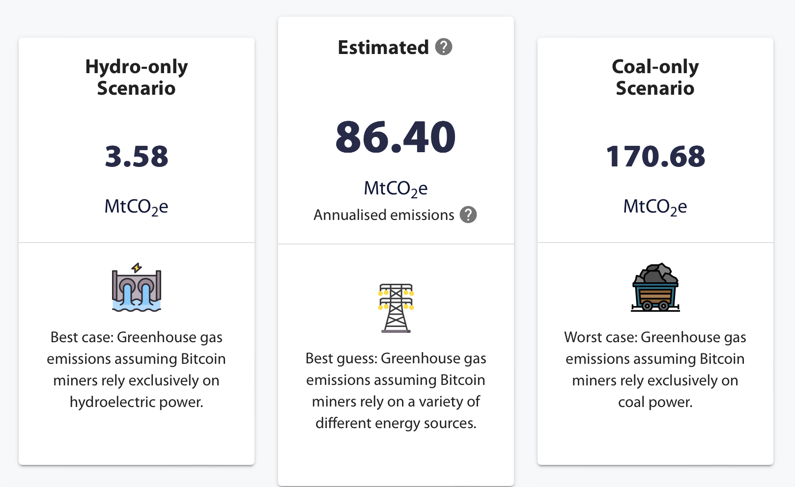

### Compare Cambridge Bitcoin Electricity Consumption Index (CBECI) emission

- Compare date: 2024/04/03
- Link to CBECI result: https://ccaf.io/cbnsi/cbeci/ghg

- CBECI emission = 86.4*10**6 = 86400000 tons/year
- Plugin param:
  + b0 = 45854865890.77089
  + b1 = 3.21680913e-10
  + Hashrate = 605E+18 H/s (https://bitinfocharts.com/comparison/bitcoin-hashrate.html#3m)
  + plugin_daily_emission = b0 + b1*hashrate = 240471818255(g) = 240471 tons
  + plugin_annual_emission = plugin_daily_emission * 365.25 = 87832032 tons

Difference = (86400000 - 87832032)/87832032 = 1.6%

### Compare CCRI API emission results

This file demonstrate a comparison between plugin results
and [CCRI API](https://v2.api.carbon-ratings.com/documentation#) results

1. Proof of work blockchain

- Plugin emission = b0 + b1*(hash rate)
- Hash rate is from [bitinfocharts](https://bitinfocharts.com/comparison/bitcoin-hashrate.html)

| Date       | Blockchain   | b0          | b1             | Hash rate  | Plugin emission(g) | CCRI emission(g) | Difference |
|------------|--------------|-------------|----------------|------------|--------------------|------------------|------------|
| 2024/04/01 | Bitcoin      | 45854865890 | 3.21680913e-10 | 593E+18    | 236611647299       | 234924489350     | 0.72 %     |
| 2024/04/01 | Bitcoin Cash | 225006297   | 3.93560793e-10 | 7.1125E+18 | 3024207437         | 2206687119       | 27%        |
| 2024/04/01 | Bitcoin SV   | -41310514   | 5.94943458e-10 | 849E+15    | 463796481          | 358620142        | 22%        |
| 2024/04/01 | Dash         | 4557871     | 4.36287796e-08 | 3.1653E+15 | 142656047          | 141712705        | 0.66%      |
| 2024/04/01 | Dogecoin     | 1046612157  | 5.62926756e-06 | 1.0771E+15 | 7109896245         | 7071077280       | 0.55%      |
| 2024/04/01 | Litecoin     | 217790973   | 6.67931768e-06 | 957E+12    | 6609897992         | 6575001476       | 0.53%      |

2. Proof of stake blockchain

Plugin emission = (b0 + b1*(total gas)) * (total nodes)

- Total gas for Solana is from this [Dune query](https://dune.com/queries/3482896)
- Total gas for Avalance is from this [Dune query]()
- Total Solana node count:https://www.validators.app/
- Total Avalanche node count: https://avascan.info/blockchain/c/info

| Date       | Blockchain | b0   | b1             | Total gas     | Total nodes | Plugin emission(g) | CCRI emission(g) | Difference |
|------------|------------|------|----------------|---------------|-------------|--------------------|------------------|------------|
| 2024/04/01 | Solana     | 2471 | 1.01622378e-11 | 7120005197996 | 1721        | 4376503            | 4765563          | 8.8%       |
| 2024/04/01 | Avalanche  | 371  | 4.89823124e-10 | 44645279607   | 1804        | 707168             | 667235           | 5.6%       |

