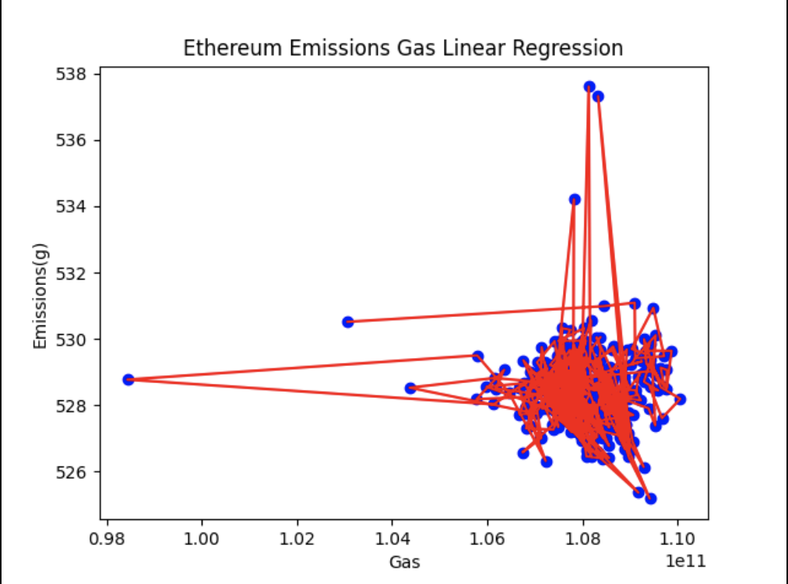
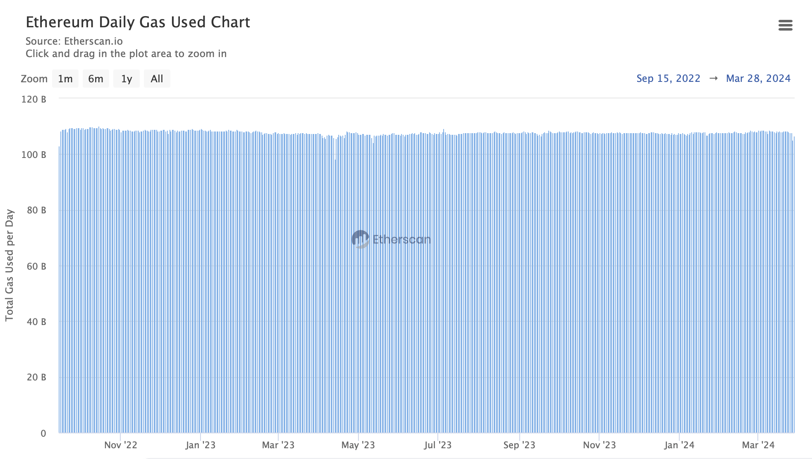
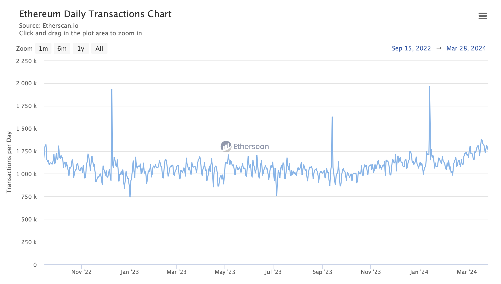

## Ethereum transaction emissions calculation

### Data source and data preprocessing
Ethereum [total transactions](https://etherscan.io/chart/tx) per day and [total gas used](https://etherscan.io/chart/gasused) per day
is both obtained from etherescan.io site. This site allows user to download csv file.

### Ethereum emission gas regression
The regression model is built in file [ethereum_emissions_gas_regression.py](ethereum_emissions_gas_regression.py)
- The result is a very weak correlation of emissions and gas with data from
  2022-09-15 (the time when [the merge](https://ethereum.org/en/roadmap/merge/) happened and Ethereum became PoS blockchain) to 2024-02-27 with `R square` = 0.0036297817564953094

In fact, since the merge happened, the total gas used remains also a straight line
regardless of total transactions changes:

This may be due to the extensive usage of L2 solutions, which group batches of transactions
on Ethereum, process them and only commit the results to Ethereum mainnet.

In conclusion, determining how much carbon emission does 1 gas produce on Ethereum
network will require more data and a new methodology.

