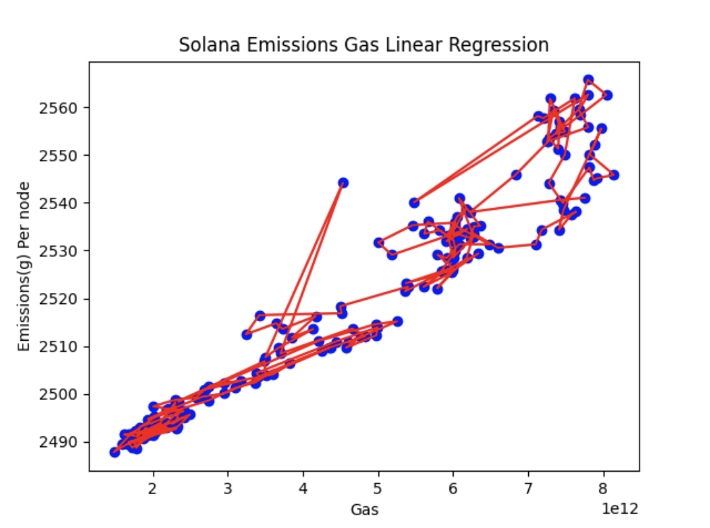

## Solana transaction emissions calculation

### Data source and data preprocessing

Solana total transactions per day and total compute unit used per day
is obtained from running [Dune](https://dune.com/browse/dashboards) queries. Dune provides raw data tables about
blockchains for us to perform queries with aggregations to obtain the necessary data. One thing to note is that Dune's
Free Plan only has limited credit, and sometimes a heavy query may take a long time to run. If the run time is too long,
it will be terminated, so we need to run a query multiple times for different date ranges to get our data.

- `Solana transactions per day`: The data is retrieved
  from this [Dune query](https://dune.com/queries/3477176)
- `Solana total gas (compute unit) per day`: The data is retrieved
  from this [Dune query](https://dune.com/queries/3482896). We need to run
  this with different `blocktime` range each time to avoid timeout error.

File [solana_preprocess_data.py](solana_preprocess_data.py) is responsible for cleaning data.
The output are file [solana_gas.csv](data/solana_gas.csv) and
file [solana_transactions.csv](data/solana_transactions.csv)

### Solana emissions gas regression

The regression model is built in file [solana_emissions_gas_regression.py](solana_emissions_gas_regression.py)

- The result is a strong correlation of emissions and hashrate with data from
  2023-09-01 to 2024-02-27 with `R square` = 0.9299947426555761

- Regression parameters are `b0: 2471.9084650492014 , b1 : [1.01622378e-11]`
  This result can be interpreted as 1 gas processed by the node
  will produce 1.01622378e-11 g of CO2
