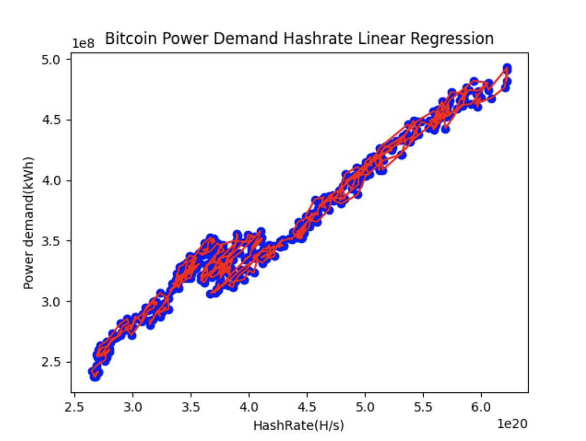

## Bitcoin network power demand calculation

### Data source and data preprocessing

- `Bitcoin power demand per day`:
  + File location: raw/bitcoin_ccri_power_demand.json
  + This data is obtained from [Crypto Carbon Rating Institue API](https://docs.api.carbon-ratings.com/v2/#/)

- `Bitcoin average hashrate per day`:
  + File location: bitcoin_hashrate.csv
  + This data is crawled from [bitinfocharts](https://bitinfocharts.com/comparison/bitcoin-hashrate.html)

### Bitcoin power demand calculation

1. `Data cleaning`: This step will clean/convert raw data from various
   sources for later steps:
  - File pow/ccri_pow_preprocessing_data.py is used for cleaning CCRI pow power demand data for
    all blockchains including bitcoin, change variable `blockchain = 'bitcoin''` to run.
    The result is file [bitcoin_power_demand.csv](data/bitcoin_power_demand.csv)

2. `Linear regression`

- File [bitcoin_power_demand_hashrate_linear_regression.py](bitcoin_power_demand_hashrate_linear_regression.py) is responsible
  for finding the relationship of power demand per day and total hashrate per day.

- The result is a strong correlation of power demand and hashrate with data from
  2023-01-01 to 2024-03-19 with `R square` = 0.9651186062927997

- Regression parameters are `b0: 90595506.70413834 , b1 : [6.35545318e-13]`

