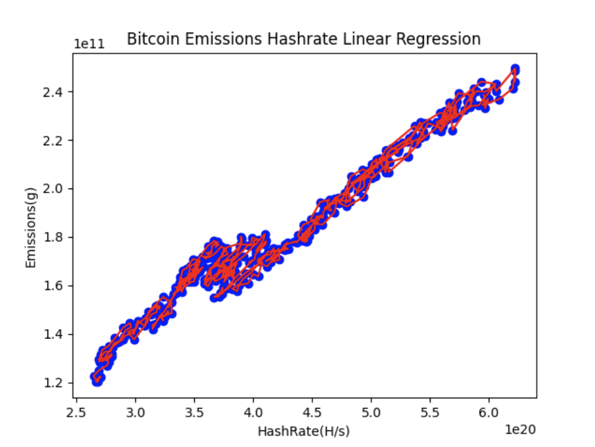

## Bitcoin transaction emissions calculation

### Data source and data preprocessing

- `Bitcoin total emissions per day`:
    + File location: raw/bitcoin_ccri_emissions.json
    + This data is obtained from [Crypto Carbon Rating Institue API](https://docs.api.carbon-ratings.com/v2/#/)

- `Bitcoin average hashrate per day`:
    + File location: bitcoin_hashrate.csv
    + This data is crawled from [bitinfocharts](https://bitinfocharts.com/comparison/bitcoin-hashrate.html)

### Bitcoin transaction emissions calculation

1. `Data cleaning`: This step will clean/convert raw data from various
   sources for later steps:
    - File pow/ccri_pow_preprocessing_data.py is used for cleaning CCRI pow emissions data for
      all blockchains including bitcoin, change variable `blockchain = 'bitcoin''` to run.
      The result is file [bitcoin_emissions.csv](data/bitcoin_emissions.csv)

2. `Linear regression`

- File [bitcoin_emission_hashrate_linear_regression.py](bitcoin_emission_hashrate_linear_regression.py) is responsible
  for finding the relationship of emissions per day and total hashrate per day.

- The result is a strong correlation of emissions and hashrate with data from
  2023-01-01 to 2024-03-19 with `R square` = 0.9651186062927997

- Regression parameters are `b0: 45854865.89077085 , b1 : [3.21680913e-13]`

