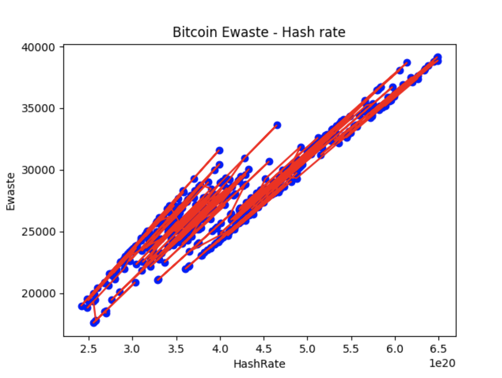

## Bitcoin transaction electronic waste calculation

### Data source and data preprocessing

- `Bitcoin mining equipment`:
    + File location: raw/bitcoin_mining_equipments_raw.csv
    + This data is maintained by CBECI at this [link](http://sha256.cbeci.org).
    Note that this link is missing some equipments' weight, these data need to be
    filled by searching online.

- `Bitcoin breakeven threshold`:
    + File location: raw/bitcoin_cbeci_breakeven_threshold_raw.json
    + This data is crawled from [CBECI methodology site](https://ccaf.io/cbnsi/cbeci/ghg/methodology)
  
- `Bitcoin average hashrate per day`:
    + File location: bitcoin_hashrate.csv
    + This data is crawled from [bitinfocharts](https://bitinfocharts.com/comparison/bitcoin-hashrate.html)

### Bitcoin transaction emissions calculation

1. `Data cleaning`: This step will clean/convert raw data from various
   sources for later steps:
    - File [bitcoin_mining_equipment_data_preprocessing.py](bitcoin_mining_equipment_data_preprocessing.py) is responsible
   for cleaning equipment and breakeven data, the result is file [bitcoin_mining_equipments](data/bitcoin_mining_equipments.csv)
   and [bitcoin_breakeven_threshold.csv](data/bitcoin_breakeven_threshold.csv)

2. `Calculate ewaste per day`: This step is done by file [bitcoin_ewaste_per_day.py](bitcoin_ewaste_per_day.py). Read the code comments
and methodology for more details.
   

3. `Linear regression`

- File [bitcoin_ewaste_hashrate_linear_regression.py](bitcoin_ewaste_hashrate_linear_regression.py) is responsible
  for finding the relationship of ewaste per day and total hashrate per day.

- The result is a strong correlation of emissions and hashrate with data from
  2023-01-01 to 2024-03-19 with `R square` = 0.8988278893042796

- Regression parameters are `b0: 9302.292008423137 , b1 : [4.42885761e-17]`

