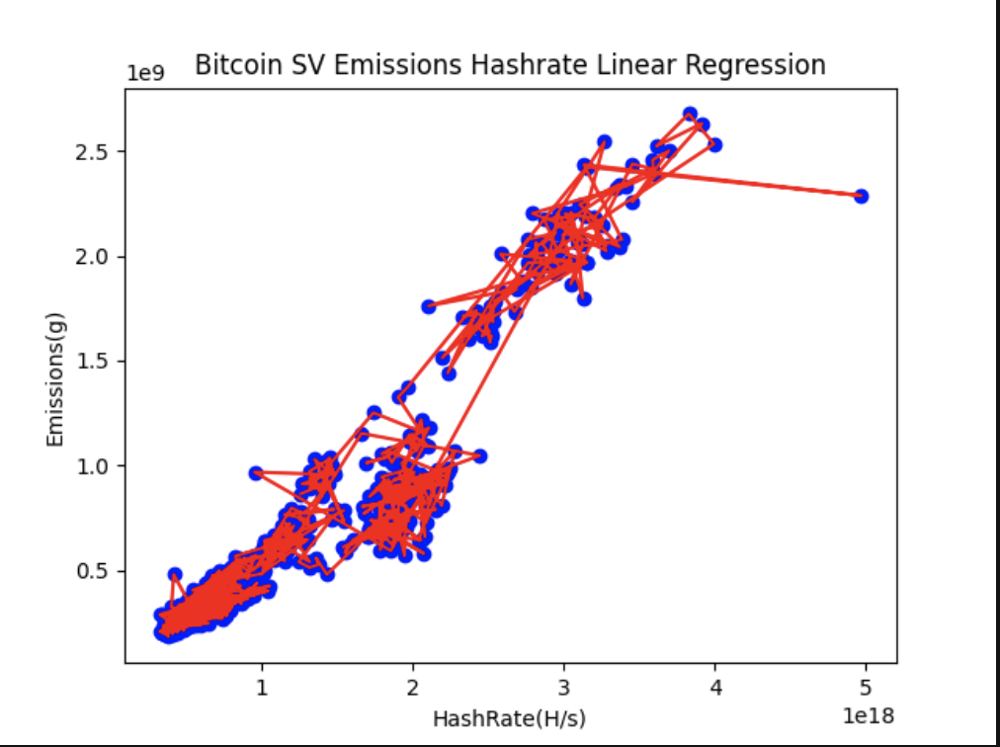

## Bitcoin SV transaction emissions calculation

### Data source and data preprocessing

- `Bitcoin sv total emissions per day`:
    + File location: [data/raw/bitcoin_sv_ccri_emissions.json](data/raw/bitcoin_sv_ccri_emissions.json)
    + This data is obtained from [Crypto Carbon Rating Institue API](https://docs.api.carbon-ratings.com/v2/#/)

- `Bitcoin sv average hashrate per day`:
    + File location: [data/bitcoin_sv_hashrate.csv](data/bitcoin_sv_hashrate.csv)
    + This data is crawled from [bitinfocharts](https://bitinfocharts.com/comparison/hashrate-bsv.html)

### Bitcoin sv transaction emissions calculation

1. `Data cleaning`: This step will clean/convert raw data from various
   sources for later steps:
    - File [ccri_pow_preprocessing_data.py](../ccri_pow_preprocessing_data.py) is used for cleaning CCRI pow emissions data for
      all blockchains including bitcoin sv, change variable `blockchain = 'bitcoin_sv''` to run.
      The result is file [bitcoin_sv_emissions.csv](data/bitcoin_sv_emissions.csv)

2. `Linear regression`

- File [bitcoin_sv_emissions_hashrate_linear_regression.py](bitcoin_sv_emissions_hashrate_linear_regression.py) is responsible
  for finding the relationship of emissions per day and average hashrate per day.

- The result is a quite strong correlation of emissions and hashrate with data from
  2020-01-01 to 2024-03-19 with `R square` = 0.9022558228680946

- Regression parameters are `b0: -41310514.23954815 , b1 : [5.94943458e-10]`

