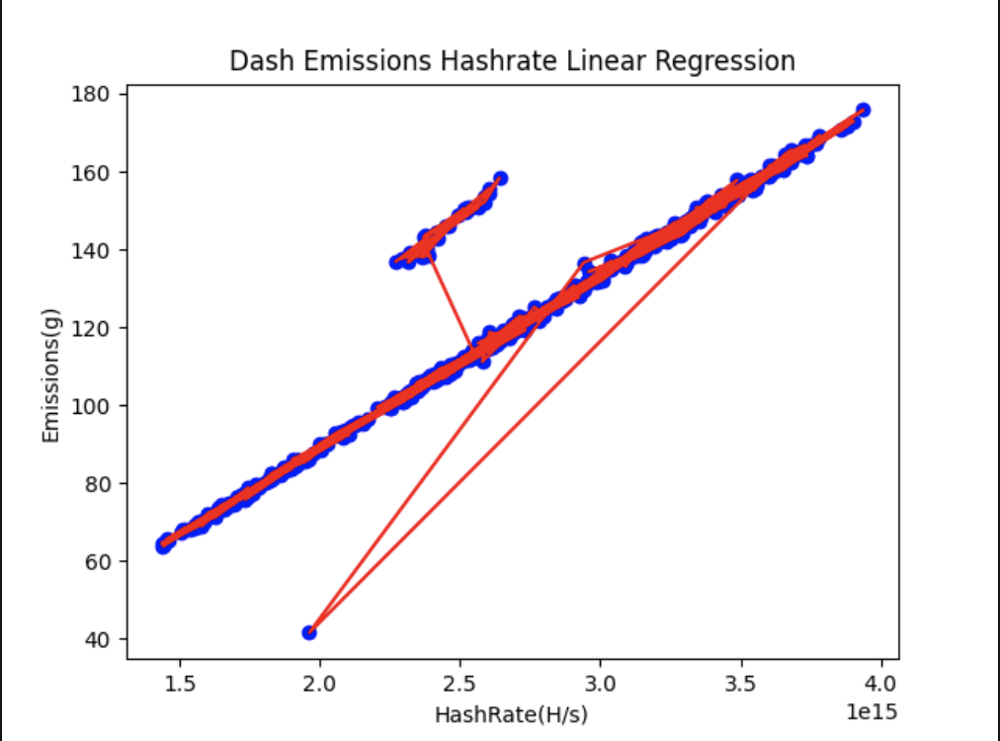

## Dash transaction emissions calculation

### Data source and data preprocessing

- `Dash total emissions per day`:
    + File location: [data/raw/dash_ccri_emissions.json](data/raw/dash_ccri_emissions.json)
    + This data is obtained from [Crypto Carbon Rating Institue API](https://docs.api.carbon-ratings.com/v2/#/)

- `Dash average hashrate per day`:
    + File location: [data/dash_hashrate.csv](data/dash_hashrate.csv)
    + This data is crawled from [bitinfocharts](https://bitinfocharts.com/comparison/hashrate-dash.html)

### Dash transaction emissions calculation

1. `Data cleaning`: This step will clean/convert raw data from various
   sources for later steps:
    - File pow/ccri_pow_preprocessing_data.py is used for cleaning CCRI pow emissions data for
      all blockchains including dash, change variable `blockchain = 'dash''` to run.
      The result is file [dash_emissions.csv](data/dash_emissions.csv)

2. `Linear regression`

- File [dash_emissions_hashrate_linear_regression.py](dash_emissions_hashrate_linear_regression.py) is responsible
  for finding the relationship of emissions per day and average hashrate per day.

- The result is a quite strong correlation of emissions and hashrate with data from
  2023-01-01 to 2024-03-19 with `R square` = 0.8841205349437461

- Regression parameters are `b0: 4557.8714524787065 , b1 : [4.36287796e-11]`

