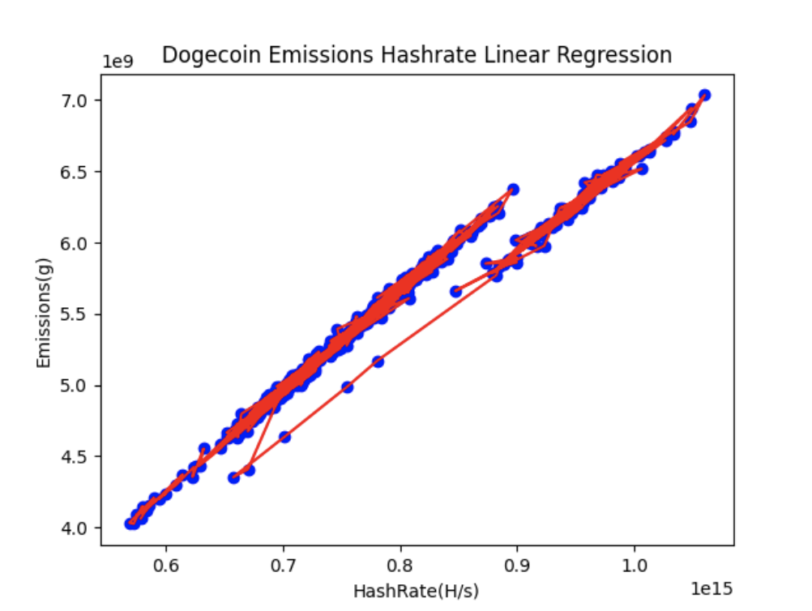

## Dogecoin transaction emissions calculation

### Dogecoin source and data preprocessing

- `Dogecoin total emissions per day`:
    + File location: [data/raw/dogecoin_ccri_emissions.json](data/raw/dogecoin_ccri_emissions.json)
    + This data is obtained from [Crypto Carbon Rating Institue API](https://docs.api.carbon-ratings.com/v2/#/)

- `Dogecoin average hashrate per day`:
    + File location: [data/dogecoin_hashrate.csv](data/dogecoin_emissions.csv)
    + This data is crawled from [bitinfocharts](https://bitinfocharts.com/comparison/hashrate-doge.html)

### Degecoin transaction emissions calculation

1. `Data cleaning`: This step will clean/convert raw data from various
   sources for later steps:
    - File pow/ccri_pow_preprocessing_data.py is used for cleaning CCRI pow emissions data for
      all blockchains including dogecoin, change variable `blockchain = 'dogecoin''` to run.
      The result is file [dogecoin_emissions.csv](data/dogecoin_emissions.csv)

2. `Linear regression`

- File [dogecoin_emissions_hashrate_linear_regression.py](dogecoin_emissions_hashrate_linear_regression.py) is responsible
  for finding the relationship of emissions per day and average hashrate per day.

- The result is a quite strong correlation of emissions and hashrate with data from
  2023-01-01 to 2024-03-19 with `R square` = 0.960132560715477

- Regression parameters are `b0: 1046.6121578388102 , b1 : [5.62926756e-12]`

