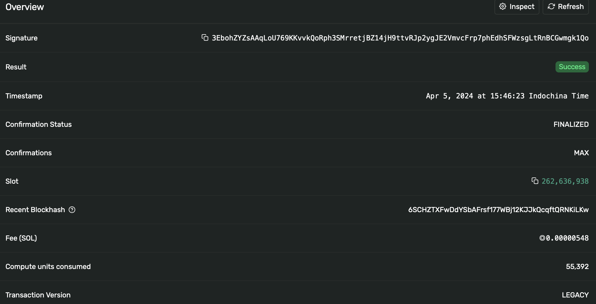

### Estimate Solana smart contract carbon usage

Steps to estimate your smart contract carbon emission. Let's take example
of a crypto Vault where there are 3 actions:

- Withdraw crypto
- Deposit crypto
- Claim Reward
-

1. Deploy your smart contract to Solana testnet
2. Test each of the above 3 transactions and get their compute unit (gas) in
   [Solana explore](https://explorer.solana.com/?cluster=testnet)



Suppose we have these compute unit result:

- Withdraw crypto: 100000
- Deposit crypto: 60000
- Claim Reward: 200000

3. To estimate your smart contract usage, it depends specifically on your organization's information. You need to
   estimate the size of your user pool and how frequently withdraw, deposit and claim rewards .
   For example:

- Deposit: 500 times/day
- Withdraw: 200 times/day
- Claim reward: 100 times/day

4. Estimate your smart contract total gas use. Based on the above result,
   Total gas used per day = 500* 60000 + 100000*200 + 200000*100 = 70000000

5. Run the plugin with this yaml input:

```yaml
name: ecochain-demo
description:
tags:
initialize:
  plugins:
    ecochain:
      path: 'https://github.com/ktg9/EcoChain'
      method: EcoChain
      global-config:
        blockchain: sol
tree:
  children:
    child-0:
      pipeline:
        - ecochain
      inputs:
        - gas_used: 70000000
          node_count: 1727
```

Solana total validators can be obtained from [this site](https://www.validators.app)

The result is that your smart contract emits:

- 1.228512927642 g CO2 per day
- 36 g CO2 per month
- 432 g CO2 per year

Your smart contract annual emission is equal to riding a small motorbike for
5km [source](https://thrustcarbon.com/insights/how-to-calculate-motorbike-co2-emissions#:~:text=If%20you%20travel%20100%20km,be%2012.8kg%20of%20CO2e.).


