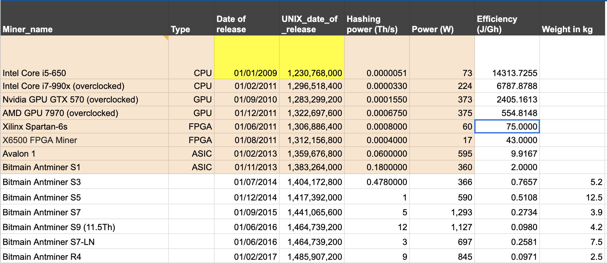
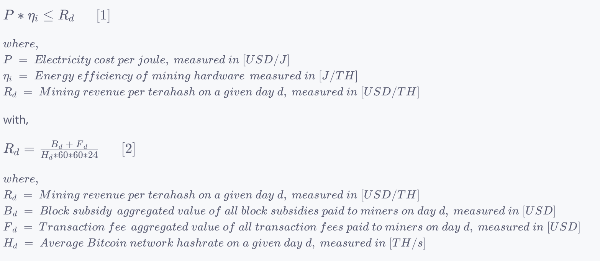
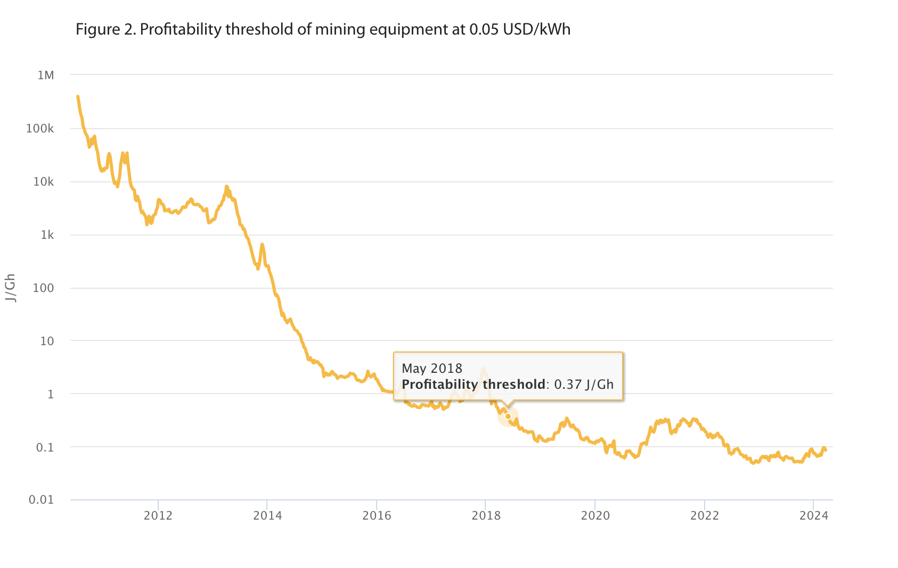
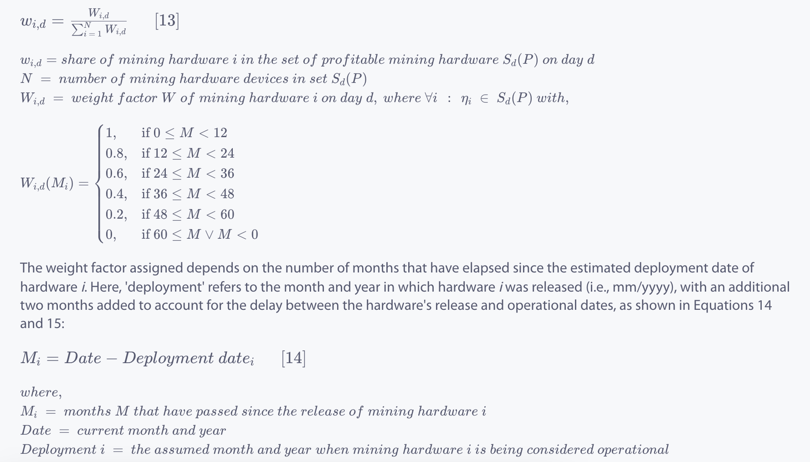
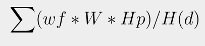

# Methodology for calculating Bitcoin transaction electronic waste

### Overview

Global waste is expected to grow by 70% by 2050 from 2016.
Though it is less discussed, electronic waste (e-waste) – which is
the waste produced by discarding electrical or electronic equipment – represents
a growing threat to our environment and includes issues from toxic
chemicals and heavy metals leaching into soils to air and water pollution caused by improper recycling.

Electronic waste contains hazardous substances,
usually heavy metals such as mercury, cadmium, or lead,
and chemicals such as chlorofluorocarbons (CFCs),
hydrochlorofluorocarbons (HCFCs), and flame retardants. Some of the contaminants in e-waste pose serious
health risks and can be responsible for kidney damage, and skin disorders, and affect the nervous and immune systems.

Science Direct provides a [research](https://www.sciencedirect.com/science/article/abs/pii/S0921344921005103)
to estimate Bitcoin's e-waste and find that it adds up to 30.7 metric kilotons annually, per May 2021; the research
also estimates that on average, each bitcoin transaction generates 272 g. That likes binning
2 iphone 12 minis.

### Background

The methodology for this plugin to estimate e waste per blockchain transaction
is heavily based on [Cambridge Methodology](https://ccaf.io/cbnsi/cbeci/methodology) and this
[paper](https://www.researchgate.net/publication/354554919_Bitcoin's_growing_e-waste_problem).
While the CBECI methodology is primarily designed for calculating Bitcoin's power demand, it could also be adapted for
estimating Bitcoin transaction electronic waste with some modifications

### Methodology

1. CBECI provides a list of [all mining equipments](http://sha256.cbeci.org/),
   This list was compiled from various public resources, which detail different types of mining equipment and their
   specifications. It includes comprehensive information about mining equipment, including release dates, power demands,
   hashing power, and weight. Weight is a crucial parameter in calculating Bitcoin transaction electronic waste.

2. The methodology for this plugin requires that we assume these things:

- `Mining nodes ('miners') are rational economic agents that only use profitable hardware`, this is also
  an important predicate for CBECI methodology
- `Mining equipment has economic lifetime of 5 years`, a standard accepted in the CBECI methodology.
  In this context, 'economic lifetime' refers to the period after which the mining equipment is no longer considered in
  calculations. Consequently, for the e-waste calculation in this plugin, the average lifespan of all equipment is also
  assumed to be 5 years.

3. Steps for estimating bitcoin transaction e waste:

- `Selecting mining equipment`:
  + A list of active equipment, the [CBECI list](http://sha256.cbeci.org/) is used
    

- `Calculate profitability threshold`:
  + The profitability threshold is measured in J/TH or W/TH. To be profitable, a mining equipment must have parameters
    that satisfies:
    (Power demand / Hashing power) < profitability threshold
  + In other words, the more hashing power an equipment has, the more BTC it can mine, resulting in more profit.
    Conversely, the higher the power demand, the greater the electricity cost, leading to less profit. Therefore, the
    ratio of power demand to hashing power must be smaller than a threshold for the equipment to be profitable

  

  + Here is the graph for profitability threshold provided by CBECI:

  

- `Create a list of profitable mining equipments`:
  +On a given day, we can generate a list of profitable mining equipment by comparing the profitability threshold with
  the parameters of all mining equipment
- `Calculate weighting factors for each profitable mining quipments`:
  + Each profitable mining equipment is assigned a weight factor, which is determined by a function based on the current
    time and the deployment date of the equipment. The deployment date is set as 2 months after the release
    date. This function is illustrated by CBECI as follows:
    

- `Calculate the total equipment amount`:
  + The daily total equipment amount is calculated as:

  

  + **weightfactor** is the factor calculated for each profitable mining equipments
  + **W** is the weight (in kg) of the equipment
  + **Hp** is the hash power of equipment (TH/s)
  + **H(d)** is the average hash rate on day d
  + This formula is derived from
    the [paper](https://www.researchgate.net/publication/354554919_Bitcoin's_growing_e-waste_problem)

- `Calculate ewaste per day`:
  + Since the economic lifespan of all equipment is assumed to be 5 years, the electronic waste per day of Bitcoin
    equals the total equipment amount divided by (5 * 365.25).

- `Calculate ewaste per bitcoin transaction`:
  + After the `e-waste per day` of the entire Bitcoin network is available, the plugin will attempt to find the
    relationship between daily electronic waste and average daily hash rate through linear regression.
    `ewaste = b0 + b1*hashrate`
  + If a model with a high R-squared value is found, it will be utilized to calculate the e-waste for each Bitcoin
    transaction on a given day as follows: `( b0 + b1*hashrate(d)) / (total transactions (d))`

### Reference
1. CBECI methodology: https://ccaf.io/cbnsi/cbeci/methodology
2. Paper on bitcoin e waste by Alex de Vries and Christian Stoll: https://www.researchgate.net/publication/354554919_Bitcoin's_growing_e-waste_problem

