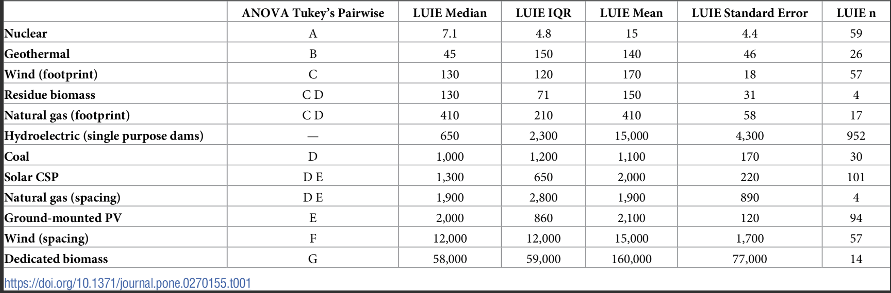
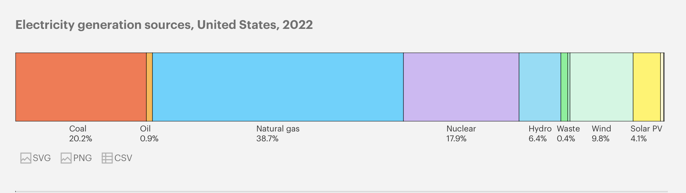

# Methodology for calculating bitcoin transaction land usage

### Overview

Land conversions is listed as an [ecological ceiling](https://guides.co/g/doughnut-economy/170288)

According to Stockholm Resilience Centre: "Land is converted to human use all over the planet.
Forests, grasslands, wetlands and other vegetation types have primarily been converted to agricultural land.
This land-use change is one driving force behind the serious reductions in biodiversity, and it has impacts on
water flows and on the biogeochemical cycling of carbon, nitrogen and phosphorus and other important elements.
While each incident of land cover change occurs on a local scale, the aggregated impacts can have consequences for
Earth system processes on a global scale. A boundary for human changes to land systems needs to reflect not just
the absolute quantity of land, but also its function, quality and spatial distribution. Forests play a particularly
important role in controlling the linked dynamics of land use and climate, and is the focus of the boundary for land
system change."

Bitcoin land footprint is also a serious
issue. [UN study](https://unu.edu/press-release/un-study-reveals-hidden-environmental-impacts-bitcoin-carbon-not-only-harmful-product)
estimates that Bitcoin footprint is about 1.4 times the area of the Los Angeles (1,870 square kilometers).

### Methodology

The methodology used by this plugin to estimate land use in Bitcoin transactions is based on the research outlined in
this [paper](https://agupubs.onlinelibrary.wiley.com/doi/10.1029/2023EF003871)
and data from [CCRI API](https://v2.api.carbon-ratings.com/documentation). Below is the summary of the methodology:

1. `Land use intensity`: Land use intensity (LUI) is a recognized socioecological metric that seeks to quantify the
   amount of land needed to produce a specific product. LUI holds significant importance because increased land usage in
   a particular process can limit availability for other vital purposes, such as food production. This can lead to
   social conflicts and tensions arising from land distribution issues. In this methodology, our focus will be on
   assessing the land use intensity associated with electricity production

2. Electricity production LUI estimates the amount of land needed to generate electricity.. For example:

The unit here is ha/TWH/y; for example from column `LUIE Median`, to produce 1 TWH of `Hydroelectric`,
650 ha of land must be used in a year.
The plugin uses LUI values of
this [research](https://journals.plos.org/plosone/article?id=10.1371/journal.pone.0270155#pone-0270155-t001).

3. With the provided data, we can approximate the amount of land utilized by Bitcoin by considering its electricity
   consumption and the distribution of electricity consumption across various technologies (such as hydroelectric,
   nuclear, etc.). To do this, the methodology relies on 2 data sources:

- [CCAF mining map](https://ccaf.io/cbnsi/cbeci/mining_map), this information offers insights into the distribution of
  Bitcoin's total hashrate (e.g., China 21.1%, US 37.8%, etc.). The methodology operates under the assumption that the
  distribution of hashrate is also representative of the distribution of power demand.
- The energy mix of countries provided by IEA (International Energy Agency)
  For example, [us electricity sources](https://www.iea.org/countries/united-states/electricity)

Part of the mining map provided by CCAF does not belong to any country (denoted by 'Other' in their map). In that case,
the [world average](https://www.iea.org/data-and-statistics/data-tools/energy-statistics-data-browser?country=WORLD&fuel=Energy%20supply&indicator=ElecGenByFuel)
energy mix is used.

Here, we need to make the assumption that the electricity used for Bitcoin mining is distributed in alignment with each
country's electricity distribution across various technologies (such as coal, oil, etc.).

4. Calculate Bitcoin transaction land use:

- First, a regression model is constructed to identify the relationship between hashrate and power demand. If a strong
  correlation is discovered, the model can then be utilized to estimate power demand based on future hashrate value.
- Then bitcoin land use can be calculated as follows:
  + First get the total Bitcoin power demand
  + Then use mining map to calculate each country Bitcoin electricity consumption
  + Then use IEA data to calculate land footprint for each country as:
    `country Bitcoin land footprint = sum(sector_share * sector_LUI)`.
    In that `sector_share` is the energy sector (Coal, Nuclear,...) share in the country electricity mix,
    `sector_LUI` is the sector land usage intensity.

- Calculate Bitcoin transaction land use = `(bitcoin daily land use)/(daily transactions)`

### Reference

1. United Nations University
   article: https://unu.edu/press-release/un-study-reveals-hidden-environmental-impacts-bitcoin-carbon-not-only-harmful-product
2. Land-use intensity of electricity production and tomorrow’s energy
   landscape: https://journals.plos.org/plosone/article?id=10.1371/journal.pone.0270155#pone-0270155-t001
3. CCAF mining map: https://ccaf.io/cbnsi/cbeci/mining_map

