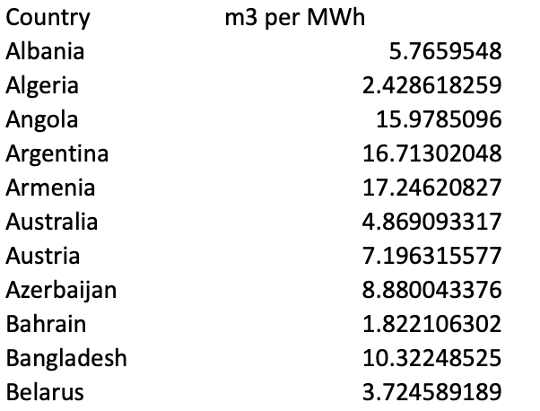

# Methodology for calculating Bitcoin transaction water consumption

### Overview

Amid growing concerns over the impacts of climate change on worldwide water
security, Bitcoin’s water footprint has rapidly escalated in recent years.
The water footprint of Bitcoin in 2021 significantly increased by 166% compared
with 2020, from 591.2 to 1,573.7 GL. The water footprint per transaction
processed on the Bitcoin blockchain for those years amounted to 5,231 and 16,279 L,
respectively. As of 2023, Bitcoin’s annual water footprint may equal 2,237
GL [[1]](https://www.sciencedirect.com/science/article/pii/S2949790623000046).

According to these figures, a single transaction costs more water than an average American household uses in 2 weeks.
With between 2 and 3 billion people worldwide already facing water shortages, a situation expected to deteriorate in the
coming decades, there is growing international concern about drinking water availability. It is therefore imperative to
comprehend the water footprint of Bitcoin mining and its potential impact.

### Methodology

The methodology of this plugin is based on
this [paper](https://www.sciencedirect.com/science/article/pii/S2949790623000046#mmc1)
and data from [CCRI API](https://v2.api.carbon-ratings.com/documentation)

1. Bitcoin utilizes water in 2 main ways:

- `Direct water consumption` for cooling system and air humidification.
  Water usage depends on cooling system types and local climate conditions.
- `Indirect water consumption` for generating the electricity necessary to power
  their devices

2. Calculate direct water consumption:

- `WUE (Water Usage Effectiveness )` is a critical metric for assessing the water
  efficiency of data centers. It specifically measures the amount of water used to
  cool the facility’s equipment.
- `WUE` is calculated as the ratio of the data center’s annual water use (in liters)
  to the energy consumed by its IT computing equipment, measured in kilowatt hours (kWh).
  Thus, WUE is expressed in liters per kilowatt-hour (L/kWh). According to Meta Platforms
  (formerly Facebook), the industry’s average WUE was most recently 1.80 L/kWh, indicating
  that 1.80 liters of water were used for every kilowatt-hour of electricity consumed.
- Using value `WUE = 1.8L/KWH`, we can calculate bitcoin direct water consumption
  = (power demand) * wue = (power demand) * 1.8
- Bitcoin power demand can be retrieved by [CCRI API](https://v2.api.carbon-ratings.com/documentation)

3. Calculate indirect water consumption:

- Each country has its own `electricity water intensity` value, representing the amount of water required to generate 1
  kWh of electricity. Below is a sample of the table provides
  by the paper:

- Using this table, we can compute Bitcoin's indirect water consumption by considering both the total Bitcoin power
  demand and the mining shares of each country. Mining shares provide information about the average hashrate share held
  by each country (e.g., US: 30%, China: 20%, etc.).

- Indirect water consumption = `sum(country_share * total power demand * country_water_intensity)`

- Note that in this calculation, we also assume that the distribution of hashrate corresponds to the distribution of
electricity consumption.

- [CCAF](https://ccaf.io/cbnsi/cbeci/mining_map) has a mining shares map we can reference

4. Calculate water consumption per bitcoin Transaction

- First, a regression model is constructed to determine the relationship between hashrate and power demand. If a strong
  correlation is identified, the model can then be employed to estimate power demand based on future hashrate levels.
- Then get the total bitcoin water consumption = direct water consumption + indirect water consumption. In that:
  + direct water consumption = 1.8 * power demand
  + indirect water consumption = sum(country_water_intensity * country_share * power_demand)
- Water consumption per Bitcoin transaction can then be calculated as `(daily water consumption)/(daily transactions)`

### Reference

1. https://www.sciencedirect.com/science/article/pii/S2949790623000046
2. https://v2.api.carbon-ratings.com/documentation
3. https://ccaf.io/cbnsi/cbeci/mining_map
