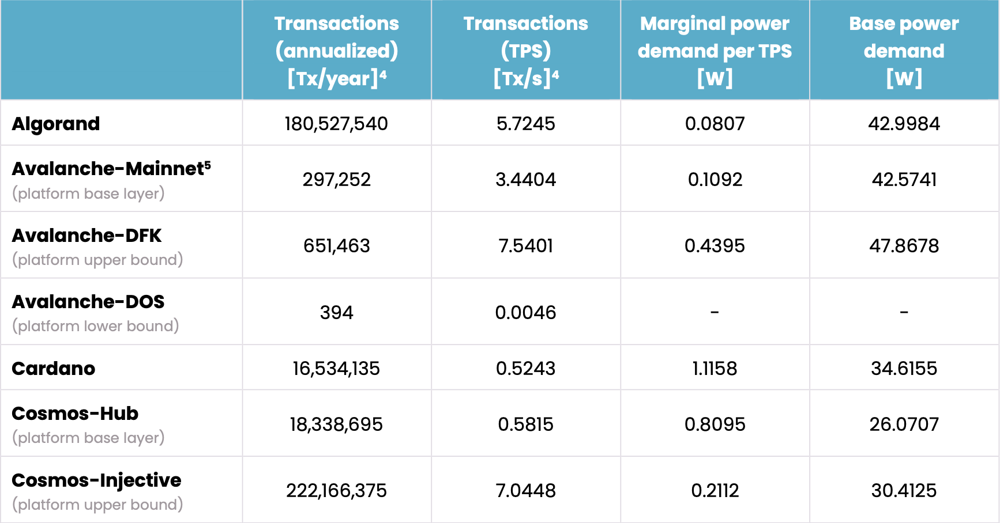
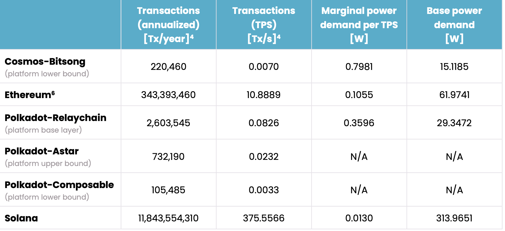
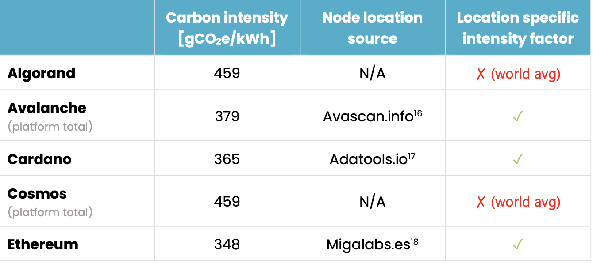

# Methodology for calculating proof of state blockchain transactions emission

### Overview

Proof-of-stake is a cryptocurrency consensus mechanism for processing
transactions and creating new blocks in a blockchain. Examples of PoS blockchains
include Solana, Polkadot, Cosmos, Avalanche,... Ethereum was first a Proof-of-work (PoW) blockchain
but after [the merge](https://ethereum.org/en/roadmap/merge/) they have since become
a Pos blockchain and reduces its [energy consumption](https://ethereum.org/en/energy-consumption/) by 99.99%.

Here's a summary of how PoS works:

- `Staking`: In a PoS system, participants (also called validators or stakeholders) are required
  to lock up a certain amount of cryptocurrency tokens as collateral, known as their stake. This
  stake is used as a form of security deposit to incentivize honest behavior. For example, you need 32 ETH
  to activate Ethereum validator software.

- `Selection of validators`: Validators are chosen to create new blocks and validate transactions based
  on the amount of cryptocurrency tokens they have staked. Generally, the higher the stake a validator holds,
  the higher the chance they have of being selected to validate transactions and earn rewards

- `Block creation and validation`: Validators take turns proposing and validating blocks of transactions.
  The probability of being chosen to propose a new block is typically proportional to the validator's stake.
  Once a validator is selected, they create a new block containing transactions and add it to the blockchain.

- `Block Finalization and Consensus`: : Other validators verify the proposed block and check whether it meets
  the consensus rules of the network. If the block is valid, it is added to the blockchain. Consensus is achieved
  when a supermajority of validators agree on the validity of the proposed block.
- `Reward Distribution`: Validators who successfully propose and validate blocks are rewarded with transaction fees
  and newly minted cryptocurrency tokens. The rewards are distributed based on the validator's stake and their
  contribution to the network.

- `Slashing`: Validators are incentivized to behave honestly, as malicious behavior can result in a portion of their
  stake being slashed
  (i.e., confiscated). Malicious behavior may include attempting to validate invalid transactions or double-spending.

One important thing to note is that PoS (Proof of Stake) blockchains do not require validators to solve complex
mathematical puzzles. Consequently, the energy consumption of PoS blockchains is much lower compared to PoW (
Proof of Work) blockchains.

### CCRI Methodology to find Pos blockchain node emission

The methodology for finding blockchain transaction emission is based
on [CCRI research](https://carbon-ratings.com/dl/pos-report-2023)
Blow is a summary of CCRI methodology:

1. Analyze the selected PoS networks and their minimum hardware requirements

- The hardware requirements are an indicator of the hardware composition of the network.
- CCRI uses this information and additional hardware data from PassMark (Passmark Software, 2021) to select and obtain
  hardware that
  they use to measure a single node's electricity consumption.

2. Measure the electricity consumption of a single node and provide upper and lower
   bounds for each network:

- CCRI starts by running the software required by the respective network on all selected
  hardware devices and measure their electricity consumption while running the network and while idling.
- CCRI also captures further data points, such as CPU utilization and processed blocks, to be able to evaluate
  additional metrics.

3. Estimate the electricity consumption of the entire networks:

- Firstly, CCRI collects information about the size of the network, as the node count significantly influences
  the total amount of electricity consumed
- Secondly, CCRI develops a weighting between the single hardware devices for each network.
- Lastly, they multiply the electricity consumption of the weighted nodes by the number of nodes in the network.

4. Calculate the energy efficiency of transaction throughput for each network:

- CCRI takes samples of the nodes’ electricity consumption periodically and examine the number of transactions that the
  single nodes handled during the respective time periods. This allows them to describe the marginal influence of the
  number
  of transactions on the electricity consumption of a node in a specific network.
- As a result, CCRI establishes a model to estimate a node’s power consumption based on the number of transactions. This
  also enables them to track the electricity consumption of a network over time, as node count and transaction volume
  change.

The result of the 4th step is a table reflecting energy consumption of each node
on each network (ethereum, solana,...) and also marginal power consumption measured in w/tps/s.

5. Estimate carbon intensity for each blockchain:

- Depending on the underlying energy sources, the respective carbon footprint of the electricity consumption
  can vary. For a precise estimate of the carbon footprint, two pieces of data are essential: The location of the
  electricity consumers as well as the carbon intensity of the respective grid.
- CCRI calculates the average
  carbon intensity of the countries in which the nodes are located utilizing country specific emission factors. Below is
  some carbon intensity values calculated by CCRI:

### The plugin methodology for calculating blockchain transaction power demand

The methodology is explained in these steps:

1. Find relationship between number of gas consumed and emission:

- The core of the methodology is rooted in the concept of `gas`. Gas serves as a unit measuring the computational effort
  required to execute specific operations on a PoS (Proof of Stake) blockchain network. While some blockchains define
  this unit as `gas` others refer to it as a `compute unit` as seen in Solana. Users are required to pay gas fees in
  native tokens for the network to process their transactions. It's important to note that not every PoS network
  incorporates the notion of a compute unit or gas. For instance, Algorand does not utilize gas fees; instead,
  transaction fees are determined solely by the transaction size and not by transaction complexity.

- The plugin attempts to find the relationship between emissions of a single node and the total number of gas consumed
  on the network. This relationship will elucidate how the increase in gas usage impacts the rise in energy consumption.
  To ascertain this relationship, the plugin aggregates data from these data sources:
  + Total gas/compute unit consumed per day of a network
  + Total transactions per day of a network

- With total transactions, we can calculate throughput (tps - transactions per second) and then find emission for each
  node
  base on CCRI table. For example, to calculate each Solana node emission with
  tps = 2000 (transactions per second):

  `power demand = ((base power demand) + (marginal power demand per tps) * tps) * (carbon intensity) = (313.9651 + 2000*0.0130) * 327/1000 = 0.34 g`

- A linear regression model is constructed to identify the relationship between gas and emission. If a strong
  correlation is discovered, the model can then be utilized to estimate emission based on future gas value.

2. Calculate the emission for each blockchain transaction :

- First obtain the gas/compute unit consumption of transaction -> this is input by user
- Then calculate how much emission per node for processing transaction with that
  amount of gas. If b0 and b1 is the parameters of the linear regression model, then:
  `emission per node (gC02) = b0 + b1*gas`
  We can interpret this result as 1 gas will increase the emission by b1(gC02)
- The transaction emission is calculated as:
  = `(emission per node) * (total number of node)`

In summary, users will input the current total number of nodes and the amount of gas their transactions consume. They
will receive information on how much emission their transactions emit as output.

### Reference
1. CCRI methodology on POS power demand: https://carbon-ratings.com/dl/pos-report-2023
2. CCRI api: https://v2.api.carbon-ratings.com/documentation

